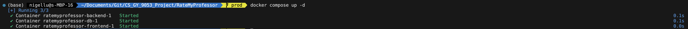

# Rate My Professor

> CS-GY 9053 Final Project (SpringBoot REST)

## Getting Started Guide

### Things you need

- Clone the frontend and backend repo (please make sure you clone both under the same folder)
  - frontend repo: https://github.com/NigelLu/RateMyProfessorUI
  - backend repo: https://github.com/NigelLu/RateMyProfessor
  - sample command you may wanna use

    ```bash
      # navigate to the folder you wanna put both repos in
      cd <folder_of_your_choice>

      # clone both repos
      git clone https://github.com/NigelLu/RateMyProfessor.git
      git clone https://github.com/NigelLu/RateMyProfessorUI.git
    ```

  - after cloning, your should have a folder structure like this

    ```txt
      ├── <folder_of_your_choice>
      │   ├── RateMyProfUI
      │   ├── RateMyProfessor
    ```

- Install Docker and make sure you have docker CLI available in your command line. Tutorial [here](https://docs.docker.com/engine/install/). After installing the Docker engine, you can test it using:

  ```bash
    docker -v
    # if the installation is correct, 
    # this command should give you something like
    # "Docker version 24.0.7, build afdd53b"
  ```

### Run the app in Docker

- In the backend repo, there is a file named `compose.yaml` that tells Docker to run 3 containers for backend, frontend, and PostgreSQL respectively.
- To get the whole project running, all you need to do is as below

  ```bash
    # assume you have cd-ed into your <folder_of_your_choice>

    # cd into the backend repo, where the `compose.yaml` resides
    cd RateMyProfessor

    # use Docker CLI to compose and run the whole project
    docker compose up -d
  ```

- After successfully executing the command, you should see something like below in your command line (first time running this might take a while as Docker needs to pull and install all dependencies)
  

- Hooray, you have successfully started the application. Now visit [here](http://127.0.0.1:3000/) to start using Rate My Professor -> http://127.0.0.1:3000
